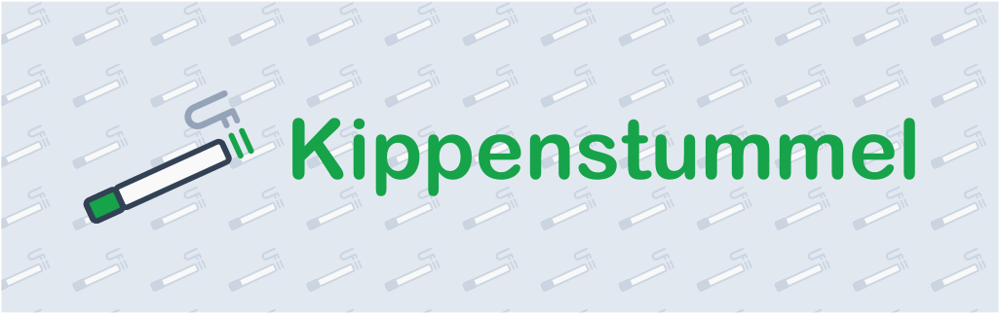

# Kippenstummel API

> Backend API for Kippenstummel.

## Table of contents

- [Introduction](#introduction)
- [Deployment](#deployment)
- [License](#license)
  - [Forbidden](#forbidden)

## Introduction

This is the backend API for Kippenstummel. It is a simple API that contains
the necessary endpoints and application logic of the platform.

## Deployment

Kippenstummel API is generally operated on-premise. There are a few steps to
follow for installation: Firstly, the appropriate system environment with its
third-party services must be set up (See [Operation](docs/operation.md)) and secondly,
the application must be correctly configured (See [Configuration](docs/configuration.md)).
After that, Kippenstummel API can then be started and operated on-premise, optionally
scaled horizontally.

## License

Copyright (c) 2025 Constantin Müller

Permission is hereby granted, free of charge, to any person obtaining a copy
of this software and associated documentation files (the "Software"), to deal
in the Software without restriction, including without limitation the rights
to use, copy, modify, merge, publish, distribute, sublicense, and/or sell
copies of the Software, and to permit persons to whom the Software is
furnished to do so, subject to the following conditions:

The above copyright notice and this permission notice shall be included in all
copies or substantial portions of the Software.

THE SOFTWARE IS PROVIDED "AS IS", WITHOUT WARRANTY OF ANY KIND, EXPRESS OR
IMPLIED, INCLUDING BUT NOT LIMITED TO THE WARRANTIES OF MERCHANTABILITY,
FITNESS FOR A PARTICULAR PURPOSE AND NONINFRINGEMENT. IN NO EVENT SHALL THE
AUTHORS OR COPYRIGHT HOLDERS BE LIABLE FOR ANY CLAIM, DAMAGES OR OTHER
LIABILITY, WHETHER IN AN ACTION OF CONTRACT, TORT OR OTHERWISE, ARISING FROM,
OUT OF OR IN CONNECTION WITH THE SOFTWARE OR THE USE OR OTHER DEALINGS IN THE
SOFTWARE.

[MIT License](https://opensource.org/licenses/MIT) or [LICENSE](LICENSE) for
more details.

### Forbidden

**Hold Liable**: Software is provided without warranty and the software
author/license owner cannot be held liable for damages.
